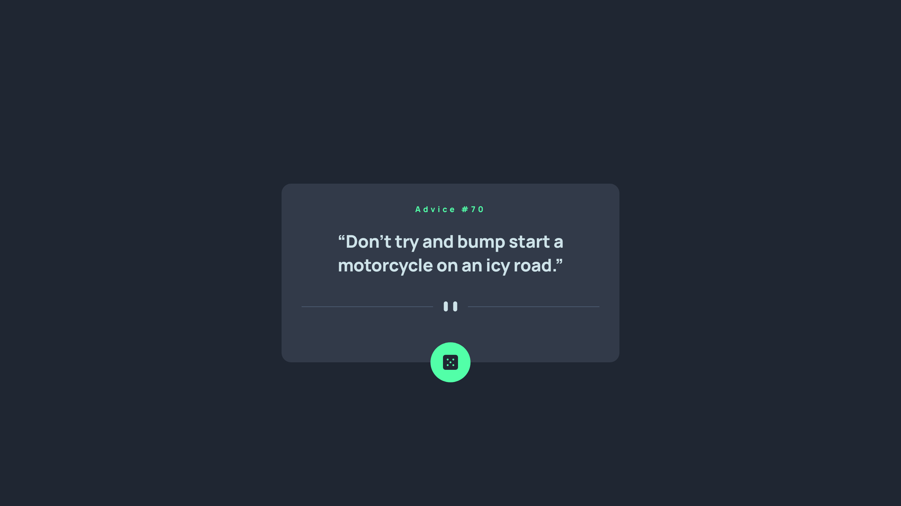
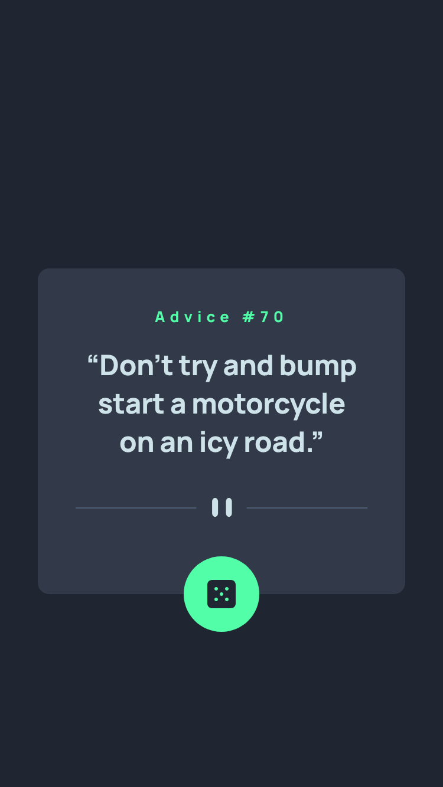

# Frontend Mentor - Advice generator app solution

This is a solution to the [Advice generator app challenge on Frontend Mentor](https://www.frontendmentor.io/challenges/advice-generator-app-QdUG-13db).

### Design screenshots

#### Desktop 🖥️

#### Tablet 💻

#### Mobile 📱

### Links

- Solution URL: [GitHub](https://github.com/JuliAlchemDev/FM-advice-generator-app)
- Live Site URL: [GitHub Pages](https://julialchemdev.github.io/FM-advice-generator-app/)

## My process

- Initialized a new repository for the **Advice Generator App** and submitted the project.
- Cleaned up unnecessary files and organized the project structure, placing all images inside the **assets** folder for consistency.
- Studied the design in Figma and extracted a **design system**, preparing **CSS custom properties** for colors, typography, spacing, and other reusable tokens.
- Built the HTML structure with **semantic tags** and **BEM naming conventions**, ensuring a maintainable and scalable markup.
- Added **accessibility features**, such as proper headings and clear alt text for buttons and decorative images.
- Implemented **responsive design** using media queries and relative units (`rem`) to adapt the layout across mobile and desktop.
- Used **CSS Grid** and `place-content` to center the card and its content.
- Developed **JavaScript functionality** to fetch advice from an API, including:
  - Initial advice fetch on page load.
  - Button to fetch new advice with a short delay and visible loading state.
  - Error handling to inform the user if fetching fails.
- Applied **UX improvements** such as disabling the dice button while loading, monitoring picture source changes for responsive images, and preparing animations for smoother content transitions.
- Styled the component using **CSS custom properties**, **pseudo-elements**, **letter-spacing adjustments**, and **shadow effects** to replicate the Figma design as closely as possible.

### What I learned

- Strengthened my understanding of **project setup and clean file organization**.
- Learned to **extract and implement a design system** from Figma using **CSS custom properties** for colors, typography, spacing, and letter-spacing.
- Improved my use of **semantic HTML5** and **BEM methodology** for a maintainable structure.
- Practiced implementing **accessible features** like proper headings, button alt text, and `focus-visible` styling.
- Gained experience with **responsive design**, **CSS Grid**, and **media queries** for a mobile-first workflow.
- Learned to manage **dynamic content with React**, including state management (`useState`), lifecycle handling (`useEffect`), and conditional rendering for loading/error states.
- Applied **UX best practices**: loading feedback, delayed fetches, button disabling, and responsive image handling.
- Improved **problem-solving skills**, deciding when to adjust design details (like shadows or text wrapping) when Figma styles didn’t translate perfectly.

### Built with

- **React** (Functional Components, Hooks: `useState`, `useEffect`)
- **Semantic HTML5**
- **CSS Grid** and **Flexbox**
- **CSS custom properties**
- **Mobile-first workflow**
- **BEM methodology**
- **Accessible markup** (`aria`, `focus-visible`, alt text)
- **Responsive design** using `rem` units and media queries
- **Figma** as the main design reference

## Author

- Linkedin - [Julia Alkhimova](https://www.linkedin.com/in/julialkhimova/)
- Frontend Mentor - [@JuliAlchemDev](https://www.frontendmentor.io/profile/JuliAlchemDev)
